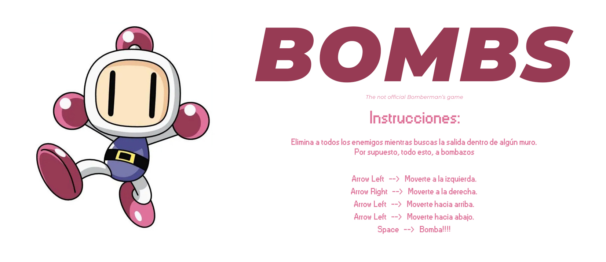

# Bombs: The Bomberman-Inspired Browser Game

**Bombs** es un proyecto inspirado en el clásico **Bomberman**, desarrollado completamente en JavaScript, HTML5 y CSS3. Este juego de navegador ofrece una experiencia retro, mezclando lo mejor de la nostalgia de los videojuegos clásicos con las capacidades modernas de desarrollo web. ¡Destruye muros, esquiva enemigos, y alcanza la victoria!

### Sobre el Desarrollo

Este proyecto fue concebido y desarrollado en solo seis días, demostrando un alto nivel de dedicación, adaptabilidad y resolución rápida de problemas. El corto plazo de tiempo resalta la capacidad de producir un juego robusto y con muchas características, sin comprometer la calidad ni la creatividad.

## 🚀 Características Principales

- **Jugabilidad Dinámica**: Controla al personaje, coloca bombas estratégicamente y acaba con tus enemigos.
- **Colisiones Avanzadas**: Implementación de un sistema robusto de detección de colisiones entre el jugador, muros, ladrillos, enemigos y explosiones.
- **Mapeado Retro**: Disfruta de un mapeado estilo clásico con muros destructibles e indestructibles, generados dinámicamente.
- **Animaciones y Explosiones Impactantes**: Cada explosión tiene un conjunto de sprites detallados que brindan una experiencia visual envolvente.
- **Sistema de Cronómetro y Vidas**: Suma puntos a medida que avanzas, pero asegúrate de no perder todas tus vidas.

## 🛠️ Tecnologías Utilizadas

- **HTML5**: Base del diseño y estructura del juego.
- **CSS3 y Animaciones**: Utilización de animaciones con `keyframes` para efectos de aparición y desaparición en elementos clave como el *Game Over*.
- **JavaScript (ES6)**: La lógica del juego está escrita en JavaScript moderno, aprovechando *setInterval* para el bucle de juego, y un sistema modular con OOP para organizar el código de los distintos elementos del juego (jugador, enemigos, bombas, etc.).
- **Git & GitHub**: Control de versiones y colaboración en el proyecto.

## 📂 Estructura del Proyecto

- `/images/`: Todos los sprites y assets visuales, incluidas animaciones de enemigos, explosiones y el personaje.
- `/js/`: Módulos de JavaScript que contienen la lógica de las bombas, colisiones, movimiento de enemigos, jugador, y el sistema de cronómetro.
- `/styles/`: Contiene el archivo CSS principal que controla el diseño del juego y sus animaciones.

## 🔥 Lógica de Juego

Este proyecto se centra en recrear el espíritu de Bomberman con una arquitectura sólida y bien pensada:

- **Gestión de Enemigos**: Cada enemigo tiene sus propias direcciones de movimiento y comportamiento, lo que añade una capa de dificultad y estrategia.
- **Bombas y Explosiones**: Las bombas tienen un temporizador y explotan en todas direcciones, destruyendo ladrillos y eliminando enemigos dentro de su rango.
- **Sistema de Vidas**: El jugador cuenta con un número limitado de vidas que disminuye con cada colisión con los enemigos. Si se queda sin vidas, ¡el juego termina!

## 🎮 Cómo Jugar

1. **Iniciar el juego**: Abre el archivo `index.html` en tu navegador.
2. **Mover al jugador**: Usa las flechas de dirección para mover a tu personaje.
3. **Colocar bombas**: Pulsa el botón de espacio para colocar una bomba.
4. **Ganar el juego**: Destruye a todos los enemigos y encuentra la puerta secreta para avanzar al siguiente nivel.

## 🎯 Retos Técnicos y Soluciones

Durante el desarrollo del proyecto, enfrenté varios retos, entre ellos:

- **Colisiones complejas**: Se desarrolló un algoritmo que revisa continuamente colisiones entre múltiples elementos en tiempo real, optimizando el rendimiento del juego para mantener una tasa de frames estable.
- **Sincronización de animaciones**: Asegurar que las explosiones y las animaciones de los enemigos se sincronizaran adecuadamente para que el jugador tenga una experiencia fluida y dinámica.

## 👨‍💻 Próximas Mejoras

- **Sonido y música**: Añadir efectos de sonido para las explosiones, movimientos y otros eventos del juego.
- **Niveles adicionales**: Actualmente, el proyecto contiene un solo mapa, pero está preparado para soportar múltiples niveles con diferentes dificultades.
- **Modo Multijugador**: Implementar un modo cooperativo para jugar con amigos.

## 📈 Habilidades Adquiridas

Este proyecto ha sido una excelente manera de reforzar mis habilidades en:

- **Manipulación del DOM**: Gestión eficiente del DOM en tiempo real para crear un juego sin interrupciones.
- **Animaciones CSS y JS**: Creación de animaciones fluídas y adaptativas.
- **Optimización de código**: Manejo de ciclos de juego y control del rendimiento mediante el uso de técnicas de optimización de bucles y colisiones.

## ❤️ Agradecimientos

A mi profesor, porque sin su guía este proyecto no habría sido posible:
* [Jorge Berrizbeitia](https://github.com/jorgeberrizbeitia)

A quien confió en mi y me dijo que no era una locura intentar hacerlo en este tiempo:
* [Jesús Suaste](https://github.com/suastech)

Y a mis compañeros de clase por aguantar mis preguntas tontas, mis preguntas pesadas, mis dos cuentas en el zoom, y sobre todo por los consejos, la ayuda y las risas.

## 🤝 Contribuciones

Si te interesa mejorar este juego, ¡no dudes en enviar un *pull request* o abrir una *issue*! Cualquier sugerencia es bienvenida.